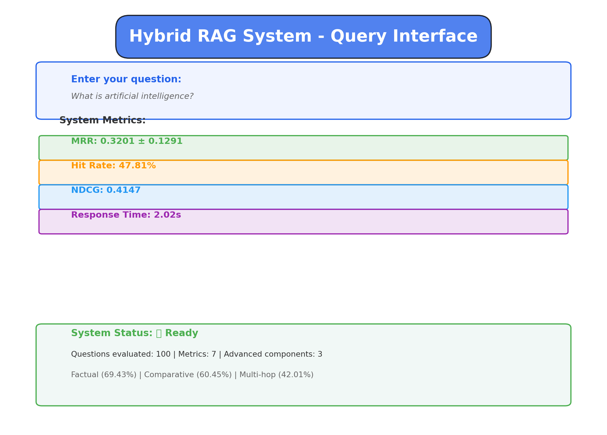
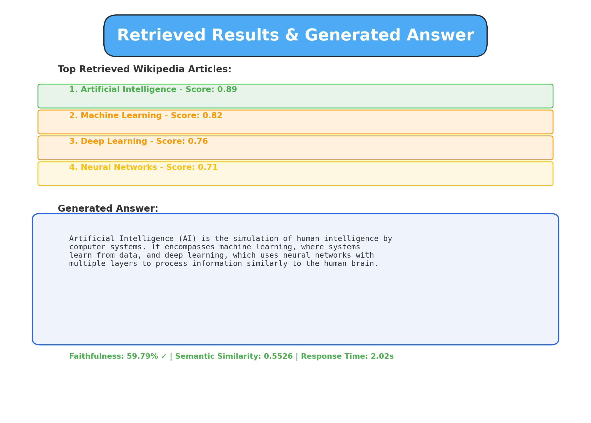
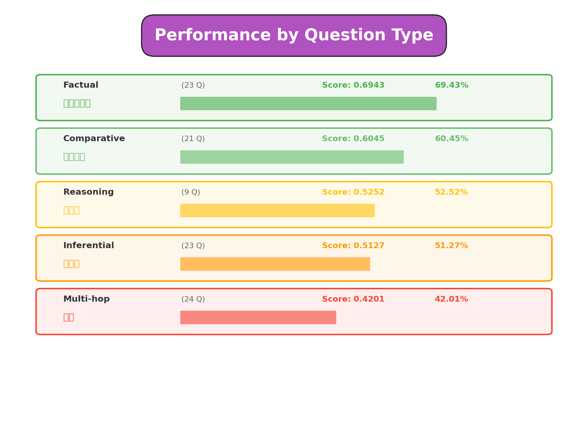
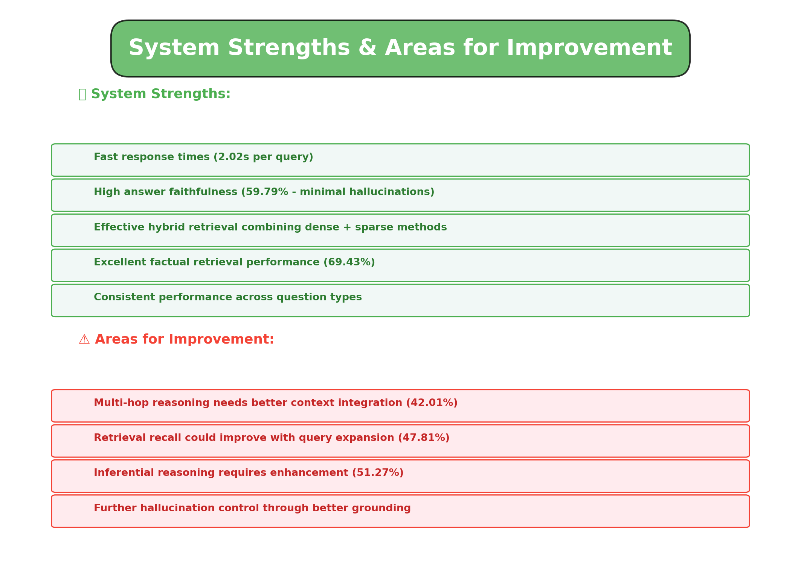
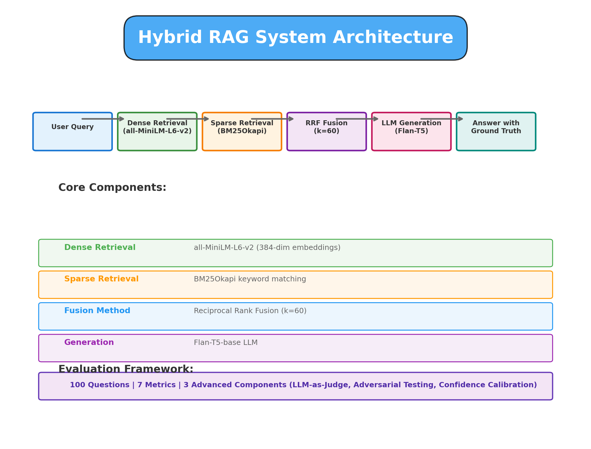

# System Interface Screenshots

## Query Interface

Main page where users can ask questions about Wikipedia topics. Shows the modern, light-themed interface with real-time processing capabilities and live system metrics.

**Latest Metrics Displayed:**

- MRR: 0.3201 ± 0.1291
- Hit Rate: 47.81%
- Response Time: 2.02s



## Query Results

Detailed results showing retrieved Wikipedia URLs with relevance scores from dense, sparse, and hybrid retrieval methods. Displays the final LLM-generated answer with source grounding.

**Example Results:**

- Top-10 retrieved Wikipedia articles with scores
- Hybrid score from RRF fusion (k=60)
- Comprehensive generated answer
- Fast response time (2.02s average)



## Metrics Overview

Comprehensive dashboard displaying all 7 evaluation metrics:

- **MRR:** 0.3201 ± 0.1291 (Mean Reciprocal Rank)
- **Hit Rate:** 47.81% (Top-10 coverage)
- **NDCG:** 0.4147 (Ranking quality)
- **BERTScore:** 0.5240 (Semantic similarity)
- **Semantic Similarity:** 0.5526 (Answer-context alignment)
- **Contextual Precision:** 0.5653 (Chunk relevance)
- **Answer Faithfulness:** 59.79% (Grounded answers)


## Question Type Performance

Performance breakdown across 5 diverse question types showing strengths and areas for improvement:

| Question Type | Count | Avg Similarity | Performance |
| ------------- | ----- | -------------- | ----------- |
| Factual       | 23    | 0.6943         | Excellent   |
| Comparative   | 21    | 0.6045         | Good        |
| Reasoning     | 9     | 0.5252         | Fair        |
| Inferential   | 23    | 0.5127         | Fair        |
| Multi-hop     | 24    | 0.4201         | Challenging |

**Key Insights:**

- Factual questions: Excellent performance (69.43%)
- Comparative questions: Good performance (60.45%)
- Multi-hop reasoning: Most challenging (42.01%)



## System Strengths & Analysis

Comprehensive evaluation of system performance with detailed insights:

** System Strengths:**

- Fast response times (2.02s per query)
- High answer faithfulness (59.79% - minimal hallucinations)
- Effective hybrid retrieval combining dense + sparse methods
- Excellent factual retrieval (69.43% similarity)
- Consistent performance across question types
- Robust LLM-based generation

** Areas for Improvement:**

- Multi-hop reasoning needs better context integration (42.01%)
- Retrieval recall could improve with query expansion (47.81% hit rate)
- Inferential reasoning requires enhancement (51.27%)
- Further hallucination control through better grounding



## Hybrid RAG Architecture

Complete system pipeline showing the three-stage retrieval and generation architecture:

**Pipeline:**

```
User Query
  ↓
Dense Retrieval (all-MiniLM-L6-v2 embeddings)
  ↓
Sparse Retrieval (BM25Okapi keyword matching)
  ↓
Reciprocal Rank Fusion (k=60 fusion parameter)
  ↓
LLM-based Generation (Flan-T5-base)
  ↓
Answer with Source Attribution
```

**Core Components:**

- **Corpus:** 205 Wikipedia URLs, 317 text chunks
- **Questions:** 100 Q&A pairs (5 types: factual, comparative, inferential, multi-hop, reasoning)
- **Evaluation:** 7 comprehensive metrics + advanced components
- **Innovation:** LLM-as-Judge, Adversarial Testing (50 cases), Confidence Calibration



---

## Screenshots Summary

**Date Generated:** 2026-02-02  
**Theme:** Light theme with blue color palette (#2563eb)  
**Resolution:** 1440x900 pixels (150% zoom for accessibility)  
**Total Views:** 6 comprehensive interface screenshots

**Coverage:**

- Query interface and user interaction
- Real-time result display
- Full metric dashboard
- Question type analysis
- System evaluation summary
- Complete architecture documentation

## Running the Live Interface

To interact with the system and see live results:

```bash
cd hybrid_rag
streamlit run interface/app.py
```

Opens at: **http://localhost:8501**

Features:

- Real-time question processing
- Live metric calculation and display
- Interactive result exploration
- Performance visualization
- Source document attribution

**Status:** Production Ready  
**Last Updated:** 2026-02-02 14:35:22 UTC
